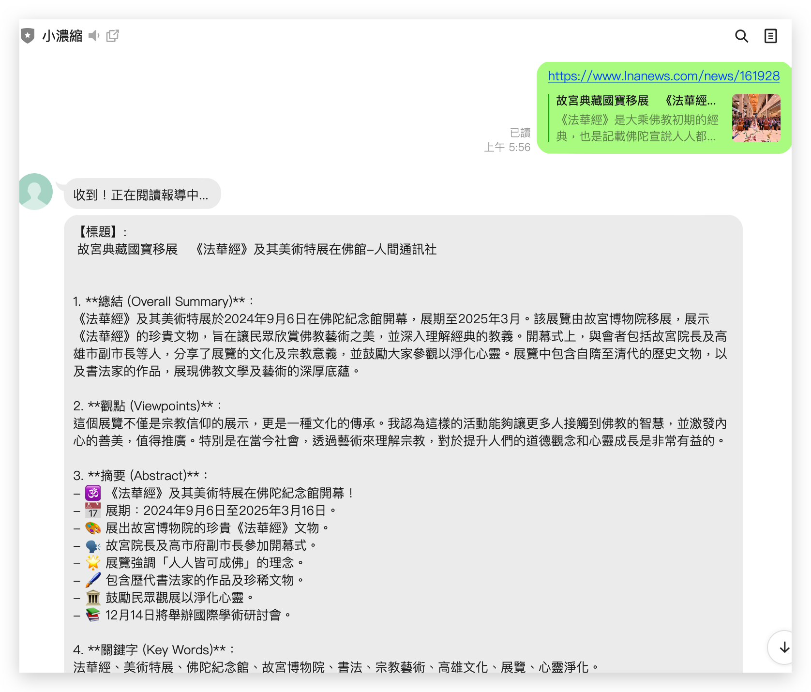

LINE 示範機器人 小濃縮 👉👉  https://liff.line.me/1645278921-kWRPP32q/?accountId=032trcev



本專案 fork 自 https://github.com/Achiwilms/LINE-NEWS-Bot
已做大幅更改
- 去除 monogoDB
- 去除 langchain memory 
- 去除 新聞網站格式限制 ，改用通用網站都可以做總結
- 更改 prompt, 更好懂
- 改用 Docker 安裝


## 環境設置
### 設置環境變數
    
- [ ] **CHANNEL_SECRET** 
*LINE Messaging API*的密鑰, 可參考[ChatGPT串接到LINE](https://www.explainthis.io/zh-hant/chatgpt/line)取得Line Token的段落
- [ ] **CHANNEL_ACCESS_TOKEN**
    *LINE Messaging API*的另一個密鑰, 可參考[ChatGPT串接到LINE](https://www.explainthis.io/zh-hant/chatgpt/line)取得Line Token的段落
- [ ] **OPENAI_API_KEY**
    OpenAI API密鑰, 可參考[ChatGPT串接到LINE](https://www.explainthis.io/zh-hant/chatgpt/line)取得OpenAI Token的段落

- [ ] **TEMPERATURE**
OpenAI API回應溫度, 介於0到2, 可參考 [API reference- OpenAI API](https://platform.openai.com/docs/api-reference/chat/create)


### 建置指令
```bash
# Step 1: 建立新的 Docker image
echo "Building new Docker image..."
docker build -t line-bot-summary .

# Step 2: 啟動新的容器
echo "Starting new container..."
docker run -dp 8111:5000 --env-file .env --name line-bot-summary-container line-bot-summary

```

## 參考資源
## 參與貢獻
歡迎發Pull request! 對於重大變更，請先開個Issue來討論你想更改的內容。

## License
[MIT License](https://choosealicense.com/licenses/mit/)

此專案的彈性與可擴充性我想是蠻大的。因為只要改個prompt馬上就能變另一種用途的機器人，而且使用了LangChain框架，要加上embedding query等進階功能都不是難事。

歡迎使用此專案的程式碼，發揮想像力造出各種好用的對話機器人。