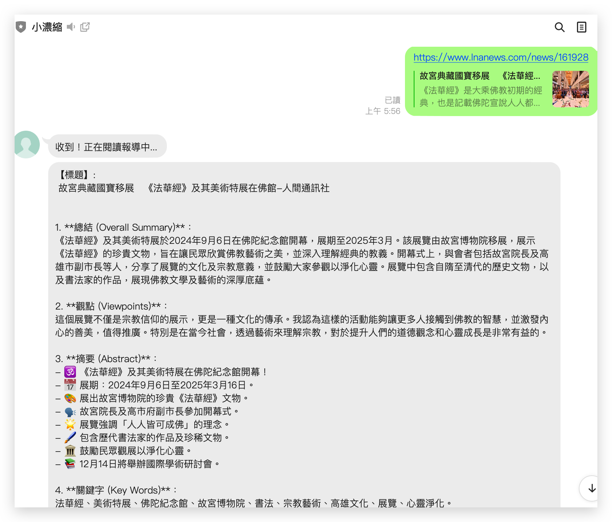

# LINE Bot 智能摘要機器人 🤖

LINE 示範機器人 小濃縮 👉👉  https://liff.line.me/1645278921-kWRPP32q/?accountId=032trcev


## ✨ 功能特色

### 🎥 多平台影音支援
支援 **1000+ 影音網站** 的內容摘要，包括但不限於：
- **YouTube** - 完整支援字幕提取和音頻轉錄
- **Bilibili** - 支援B站影片摘要
- **Vimeo** - 專業影片平台
- **Dailymotion** - 歐洲知名影片平台
- **TikTok** - 短影片平台
- **Twitch** - 直播平台
- **Facebook Watch** - Facebook 影片
- **Instagram** - 貼文、Reels、IGTV
- **Twitter/X** - 推文影片
- **SoundCloud** - 音頻平台
- **Spotify** - 音樂串流
- **TED Talks** - 演講影片
- **Coursera** - 線上課程
- **Khan Academy** - 教育影片
- 以及更多其他平台...

### 📄 網頁內容摘要
- 支援各種新聞網站、部落格、文章等純文字網頁
- 智能提取網頁核心內容
- 自動過濾廣告和無關內容

### 🧠 智能摘要格式
每個摘要包含五個部分：
- ❶ **總結** - 300字以上的完整概述
- ❷ **觀點** - 3-7個主要觀點分析
- ❸ **摘要** - 6-10個核心重點（含表情符號）
- ❹ **測驗** - 三題選擇題加深理解
- ❺ **容易懂** - 適合12歲孩子的簡化解釋

## 🔧 技術特色

本專案 fork 自 https://github.com/Achiwilms/LINE-NEWS-Bot
已做大幅更改：
- ✅ 去除 monogoDB 依賴
- ✅ 去除 langchain memory 
- ✅ 新增 **yt-dlp** 支援，擴展至 1000+ 影音網站
- ✅ 智能 URL 檢測，自動區分影音網站和普通網頁
- ✅ 雙重檢測機制，避免誤判
- ✅ 支援字幕提取和音頻轉錄備援
- ✅ 更改 prompt，產出更易懂的摘要
- ✅ 改用 Docker 容器化部署


## 🚀 環境設置

### 必要環境變數

在專案根目錄建立 `.env` 文件，並設置以下環境變數：

#### LINE Bot 設定
- **CHANNEL_SECRET** - LINE Messaging API 的密鑰
- **CHANNEL_ACCESS_TOKEN** - LINE Messaging API 的存取權杖
> 💡 可參考 [ChatGPT串接到LINE](https://www.explainthis.io/zh-hant/chatgpt/line) 取得 Line Token

#### LLM API 設定
- **LLM_API_KEY** - LLM API 密鑰（支援 OpenAI、Gemini 等）
- **LLM_BASE_URL** - API 基礎 URL（預設：`https://api.openai.com/v1/chat/completions`）
- **LLM_MODEL** - 使用的模型（預設：`gemini-2.0-flash`）
- **MAX_TOKEN_LIMIT** - 最大 token 限制（預設：`900000`）

#### Whisper API 設定（音頻轉錄）
- **WHISPER_API_KEY** - Whisper API 密鑰
- **WHISPER_BASE_URL** - Whisper API URL（預設：`https://api.openai.com/v1/audio/transcriptions`）

#### 其他設定
- **PORT** - 服務運行埠號（預設：`5000`）

### 📋 前置需求
- Docker 和 Docker Compose
- 有效的 LINE Developer 帳戶
- LLM API 金鑰（OpenAI、Google AI 等）
- 音頻轉錄 API 金鑰（用於無字幕影片）


## 🐳 快速部署

### 方法一：使用建置腳本（推薦）
```bash
# 賦予執行權限
chmod +x build.sh

# 執行建置腳本
./build.sh
```

### 方法二：手動建置
```bash
# 建立 Docker image
docker build -t line-bot-summary .

# 啟動容器
docker run -dp 8111:5000 --env-file .env --name line-bot-summary-container line-bot-summary
```

### 方法三：開發模式
```bash
# 安裝相依套件
pip install -r requirements.txt

# 直接執行
python app.py
```

## 📱 使用方式

1. **加入 LINE Bot 好友**
   - 掃描 QR Code 或點擊連結加入機器人

2. **傳送網址**
   - 直接傳送任何支援的影音網站網址
   - 或傳送一般網頁文章網址

3. **獲得智能摘要**
   - 機器人會自動識別內容類型
   - 提供結構化的五段式摘要

### 支援的輸入格式
- ✅ YouTube: `https://youtube.com/watch?v=...`
- ✅ Bilibili: `https://bilibili.com/video/...`
- ✅ 一般網頁: `https://example.com/article`
- ✅ 新聞網站: `https://news.example.com/...`

## 參考資源
## 參與貢獻
歡迎發Pull request! 對於重大變更，請先開個Issue來討論你想更改的內容。

## License
[MIT License](https://choosealicense.com/licenses/mit/)

此專案的彈性與可擴充性我想是蠻大的。因為只要改個prompt馬上就能變另一種用途的機器人，而且使用了LangChain框架，要加上embedding query等進階功能都不是難事。

歡迎使用此專案的程式碼，發揮想像力造出各種好用的對話機器人。