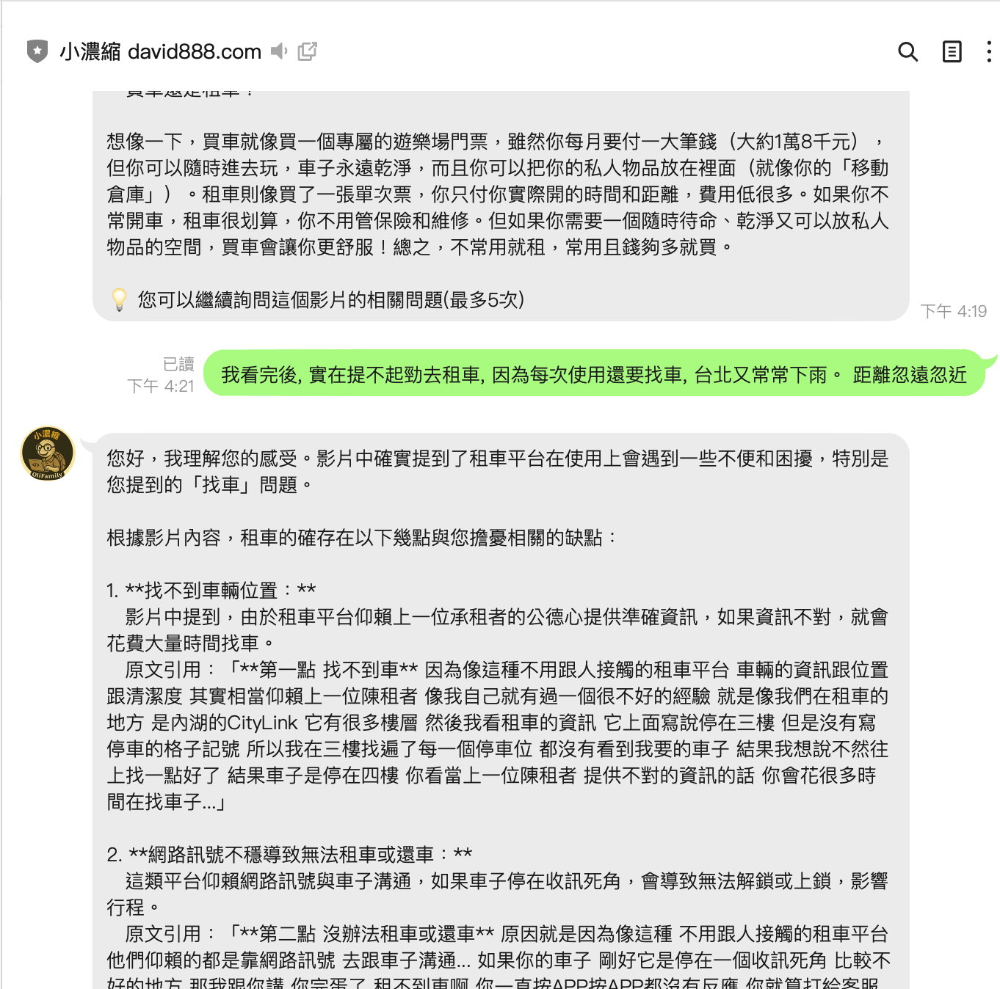

# LINE Bot 智能摘要機器人 🤖

LINE 示範機器人 小濃縮 👉👉  https://liff.line.me/1645278921-kWRPP32q/?accountId=032trcev


支援續問

## ✨ 功能特色

### 🎥 多平台影音支援
支援 **1000+ 影音網站** 的內容摘要，包括但不限於：
- **YouTube** - 完整支援字幕提取和音頻轉錄
- **Bilibili** - 支援B站影片摘要
- **Vimeo** - 專業影片平台
- **Dailymotion** - 歐洲知名影片平台
- **TikTok** - 短影片平台
- **Twitch** - 直播平台
- **Facebook Watch** - Facebook 影片
- **Instagram** - 貼文、Reels、IGTV
- **Twitter/X** - 推文影片
- **SoundCloud** - 音頻平台
- **Spotify** - 音樂串流
- **TED Talks** - 演講影片
- **Coursera** - 線上課程
- **Khan Academy** - 教育影片
- 以及更多其他平台...

### 📄 網頁內容摘要
- 支援各種新聞網站、部落格、文章等純文字網頁
- 智能提取網頁核心內容
- 自動過濾廣告和無關內容

### 🧠 智能摘要格式
每個摘要包含五個部分：
- ❶ **總結** - 300字以上的完整概述
- ❷ **觀點** - 3-7個主要觀點分析
- ❸ **摘要** - 6-10個核心重點（含表情符號）
- ❹ **測驗** - 三題選擇題加深理解
- ❺ **容易懂** - 適合12歲孩子的簡化解釋

### 💬 續問功能
- 📝 針對同一影片/網頁最多可續問 **5 次**
- 🎯 基於原始完整內容回答，確保準確性
- 📊 每次回答後顯示剩餘續問次數
- 🔄 傳送新網址即重置對話，開始新的摘要

### 📦 雲端資產儲存庫 (888box API)
- ☁️ **多端點容錯儲存**：產出的檔案、生成圖片、下載影音源或逐字稿 txt 皆可上傳至雲端儲存。
- 🔄 **自動切換機制**：
  - **主要端點**：`https://box.david888.com`
  - **備援端點 (Fallback 1)**：`https://box.glsoft.ai`
  - **備援端點 (Fallback 2)**：`https://box.aiurl.tw`
- 💬 **LINE 指令支援**：
  - 輸入 `!box`、`!stats` 或 `!空間` 即時查詢雲端儲存空間狀態與資產計數。
  - 輸入 `!img [提示詞]` 生成圖片並自動上傳至雲端儲存。

### ⏳ 即時回饋
- 🔄 **Loading 動畫** - 處理網址時自動顯示載入動畫（最長 60 秒）
- 💬 讓使用者知道系統正在處理中，提升使用體驗

## 🔧 技術特色

本專案 fork 自 https://github.com/Achiwilms/LINE-NEWS-Bot
已做大幅更改：
- 🚀 **全面升級高併發非同步架構 (FastAPI + Uvicorn Worker + BackgroundTasks)**：
  - Webhook 收到訊息立即於 **< 30ms** 內回傳 HTTP 200，繁重任務透過背景非同步執行，徹底解決多人併發塞車與逾時問題。
  - 所有 CPU/硬碟/網路阻塞任務（`yt-dlp` 下載、`ffmpeg` 影音轉檔、`trafilatura` 網頁抓取）均透過 `asyncio.to_thread` 卸載至背景執行緒池。
  - LLM 與 Whisper 均改採 `httpx` 非同步高效客戶端。
- ✅ 去除 monogoDB 依賴
- ✅ 去除 langchain memory 
- ✅ 新增 **yt-dlp** 支援，擴展至 1000+ 影音網站
- ✅ 智能 URL 檢測，自動區分影音網站和普通網頁
- ✅ 雙重檢測機制，避免誤判
- ✅ 支援字幕提取和音頻轉錄備援
- ✅ 更改 prompt，產出更易懂的摘要
- ✅ 改用 Docker 容器化部署（多 Worker Uvicorn）
- ✅ **續問功能** - 支援針對同一內容最多 5 次續問（執行緒安全對話狀態管理）
- ✅ **Loading 動畫** - 處理時非同步發送即時回饋
- ✅ **彈性 API 配置** - 自動補全 API 路徑，相容 OpenAI 格式 API
- ✅ **888box 雲端儲存模組 (`src/box_storage.py`)** - 提供同步/非同步檔案、圖片、影音、文字上傳與遠端 URL 轉存，支援三端點自動容錯。
- 🔄 **yt-dlp 保持最新機制 (`auto_update_ytdlp.sh`)** - 容器內啟動背景監測與伺服器排程，當 PyPI 有最新版 yt-dlp 時自動更新，確保 1000+ 網站提取永不失效。
- 🔄 **GitHub 倉庫自動同步腳本 (`auto_sync_repo.sh`)** - 自動監測遠端分支異動並觸發重新建置與無縫升級。
- ✅ **Python 3.13** - 升級至最新 Python 版本

## 🚀 環境設置

### 必要環境變數

在專案根目錄建立 `.env` 文件，並設置以下環境變數：

#### LINE Bot 設定
- **CHANNEL_SECRET** - LINE Messaging API 的密鑰
- **CHANNEL_ACCESS_TOKEN** - LINE Messaging API 的存取權杖
> 💡 可參考 [ChatGPT串接到LINE](https://www.explainthis.io/zh-hant/chatgpt/line) 取得 Line Token

#### LLM API 設定
- **LLM_API_KEY** - LLM API 密鑰（支援 OpenAI、Gemini 等）
- **LLM_BASE_URL** - API 基礎 URL（支援簡化格式，如 `https://gemini.david888.com/v1`，系統會自動補全 `/chat/completions`）
- **LLM_MODEL** - 使用的模型（預設：`gemini-2.0-flash`）
- **MAX_TOKEN_LIMIT** - 最大 token 限制（預設：`900000`）

#### Whisper API 設定（音頻轉錄）
- **WHISPER_API_KEY** - Whisper API 密鑰
- **WHISPER_BASE_URL** - Whisper API URL（預設：`https://api.openai.com/v1/audio/transcriptions`）

#### 888box 雲端儲存設定（選填）
- **BOX_BASE_URL** - 主要端點（預設：`https://box.david888.com`）
- **BOX_ENDPOINTS** - 逗號分隔多端點清單（預設：`https://box.david888.com,https://box.glsoft.ai,https://box.aiurl.tw`）
- **BOX_API_TOKEN** - API Token（選填，用於受保護操作）

#### 其他設定
- **PORT** - 服務運行埠號（預設：`5000`）

### 📋 前置需求
- Docker 和 Docker Compose
- 有效的 LINE Developer 帳戶
- LLM API 金鑰（OpenAI、Google AI 等）
- 音頻轉錄 API 金鑰（用於無字幕影片）


## 🐳 快速部署

### 方法一：使用建置腳本（推薦）
```bash
# 賦予執行權限
chmod +x build.sh

# 執行建置腳本
./build.sh
```

### 方法二：手動建置
```bash
# 建立 Docker image
docker build -t line-bot-summary .

# 啟動容器
docker run -dp 8111:5000 --env-file .env --name line-bot-summary-container line-bot-summary
```

### 方法三：開發模式
```bash
# 安裝相依套件
pip install -r requirements.txt

# 直接執行
python app.py
```

## 📱 使用方式

1. **加入 LINE Bot 好友**
   - 掃描 QR Code 或點擊連結加入機器人

2. **傳送網址**
   - 直接傳送任何支援的影音網站網址
   - 或傳送一般網頁文章網址

3. **獲得智能摘要**
   - 機器人會自動識別內容類型
   - 顯示 Loading 動畫表示正在處理
   - 提供結構化的五段式摘要
   - 可針對該內容繼續提問（最多 5 次）

4. **續問互動**
   - 收到摘要後，直接輸入問題即可續問
   - 系統會基於原始完整內容回答
   - 每次回答顯示剩餘續問次數
   - 傳送新網址開始新對話

### 支援的輸入格式
- ✅ YouTube: `https://youtube.com/watch?v=...`
- ✅ Bilibili: `https://bilibili.com/video/...`
- ✅ 一般網頁: `https://example.com/article`
- ✅ 新聞網站: `https://news.example.com/...`

## 🔧 技術架構

### 核心技術棧
- **Python 3.13** - 最新版本開發語言
- **Flask** - Web 框架
- **yt-dlp** - 多平台影音內容提取
- **trafilatura** - 網頁內容提取
- **LINE Messaging API** - 聊天機器人介面（含 Loading Indicator）
- **OpenAI/Gemini API** - 大語言模型
- **Docker** - 容器化部署

### 核心邏輯流程
1. **URL 檢測** - 使用正則表達式識別 URL
2. **Loading 動畫** - 顯示處理中狀態（最長 60 秒）
3. **平台判斷** - 雙重檢測機制判斷是否為影音網站
4. **內容提取** - 根據平台類型選擇提取方式
5. **智能摘要** - 使用 LLM 生成結構化摘要
6. **分段回傳** - 處理長文本自動分段
7. **對話記憶** - 儲存原始內容供續問使用（最多 5 次）

## 📊 新版本更新

### v3.0 最新功能 (2025-11)
- 💬 **續問功能** - 針對同一內容最多可續問 5 次，基於完整原文回答
- ⏳ **Loading 動畫** - 處理網址時自動顯示載入狀態，提升用戶體驗
- 🔧 **彈性 API 配置** - LLM_BASE_URL 自動補全路徑，支援各種 OpenAI 相容 API
- 🐍 **Python 3.13** - 升級至最新 Python 版本，效能更優

### v2.0 重大更新
- 🎯 **擴展影音平台支援** - 從僅支援 YouTube 擴展至 1000+ 網站
- 🧠 **智能 URL 識別** - 自動區分影音網站和普通網頁
- 🔄 **備援機制** - 字幕提取失敗時自動音頻轉錄
- 📝 **優化摘要格式** - 五段式結構化輸出
- 🐳 **容器化部署** - 完整 Docker 支援

## 🛠️ 自定義設定

### 修改摘要格式
編輯 `app.py` 中的 `get_summary_prompt()` 函數來自訂摘要風格

### 新增支援網站
在 `is_supported_by_ytdlp()` 函數的 `video_site_patterns` 列表中新增網站模式

### 調整 LLM 參數
在 `.env` 文件中調整 `LLM_MODEL`、`MAX_TOKEN_LIMIT` 等參數


歡迎發送 Pull Request！對於重大變更，請先開 Issue 討論你想更改的內容。

### 開發環境設置
```bash
# 克隆專案
git clone https://github.com/tbdavid2019/line-bot-summary.git
cd line-bot-summary

# 建立虛擬環境
python -m venv venv
source venv/bin/activate  # Linux/Mac
# 或
venv\Scripts\activate     # Windows

# 安裝相依套件
pip install -r requirements.txt
```

### 功能建議
- 支援更多語言的字幕提取
- 新增音頻品質選擇
- 實作摘要歷史記錄（資料庫整合）
- 新增使用者偏好設定
- 支援批量處理
- 擴展續問次數限制可配置化


## 🎯 專案願景

此專案具有極大的彈性與可擴充性。透過簡單的 prompt 修改，就能快速轉換成不同用途的聊天機器人。結合強大的 yt-dlp 和現代 LLM 技術，為內容摘要領域提供了完整的解決方案。

**想像無限，創造無限** - 歡迎使用此專案的程式碼，發揮創意打造各種實用的智能機器人！

---

### 📞 聯繫我們
- **GitHub Issues**: [回報問題或建議](https://github.com/tbdavid2019/line-bot-summary/issues)
- **LINE Bot 示範**: [加入機器人](https://liff.line.me/1645278921-kWRPP32q/?accountId=032trcev)

### ⭐ Star History
如果這個專案對你有幫助，請給我們一個 ⭐ Star！