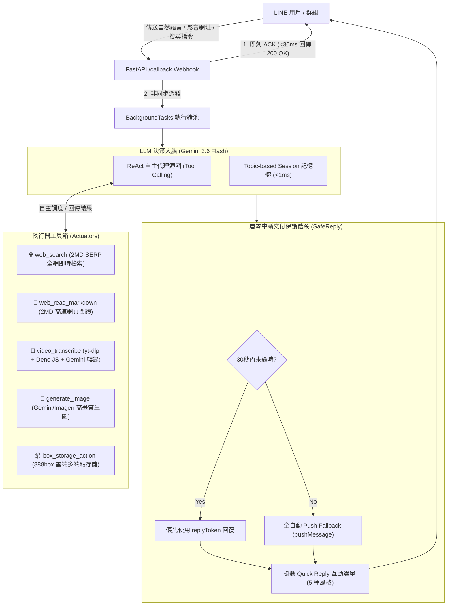
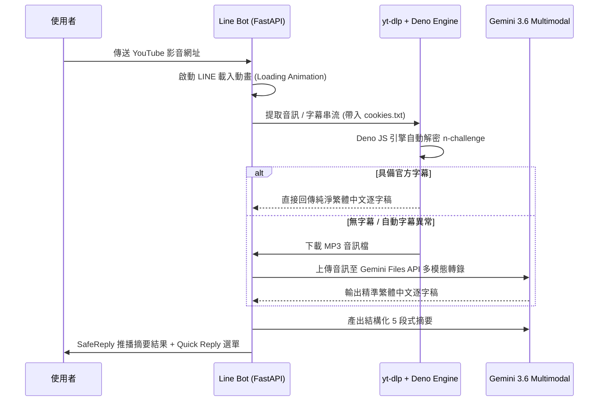

# 🚀 LINE Bot Smart Summary & Agentic Assistant 白皮書 (2026 全面重構實錄)

> 本文全面記錄 `line-bot-summary` 專案從傳統同步爬蟲機器人，進化為具備 **LLM 原生意圖解構、Tool Calling 執行器工具箱（Agentic Actuators）、SafeReply 零中斷超時保護與 LINE Quick Reply 互動濃縮** 的高併發 AI 智能助理架構。

[TOC]

---

## 1. 系統架構總覽 (Architecture Overview)

本專案採用 **FastAPI + Uvicorn 多 Worker 非同步事件驅動架構**，徹底擺脫早期版本 MongoDB 與 LangChain 龐大記憶體依賴，全面轉型為以 **Gemini 3.6 Flash / OpenAI 相容 Tool Calling** 為大腦的 ReAct 自主代理系統。



---

## 2. 五大核心技術創新 (Core Technical Pillars)

<div class="two-column-layout">

### 🤖 1. LLM 原生 Tool Calling (Agentic Actuators)
- **擺脫死記指令**：使用者不再受限於 `!s` 或 `!img`，直接用自然語言輸入任何複合需求。
- **多工具鏈式調用**：大腦可自主發起多步執行（例如：*「先查台積電最新營收，再畫一張未來晶圓廠概念圖」*）。
- **極速通道 (Fast-Track)**：單一網址直通 5 段式摘要，維持秒級響應。

### 🛡️ 2. SafeReply ➔ Push 零中斷超時保護
- **第 1 層（即刻 ACK）**：`< 30ms` 回傳 HTTP 200，杜絕 LINE 官方 1 秒超時警報。
- **第 2 層（背景異步池）**：長影音轉錄與多輪工具調用在背景隔離執行，多人併發零阻塞。
- **第 3 層（SafeReply 降級）**：`replyToken` 逾時自動無縫改走 `pushMessage`，**100% 精準送達**。

</div>

<div class="two-column-layout">

### 🎛️ 3. Quick Reply 互動切換濃縮風格
- 摘要產出後底部自動浮現 5 組快捷按鈕：
  - ⚡ **1分鐘極簡版**：3 句核心結論 + 關鍵數據。
  - 📊 **結構化大綱**：心智圖／樹狀層級架構。
  - ❓ **核心 Q&A**：拆解 5 大最具價值問答。
  - 📱 **社群貼文風**：吸睛文案、Emoji 與 Hashtags。
  - 🎨 **繪製概念插圖**：自動調用 AI 生圖。

### 🧠 4. 主題式輕量 Session 記憶機制
- **零資料庫延遲**：基於 In-Memory 字典與 `asyncio.Lock`，單次檢索 `< 1ms`。
- **精準上下文注入**：將完整逐字稿錨定為背景，支援連續 5 次深度追問。
- **自動生命週期**：額度用完自動釋放，新網址立即切換主題。

</div>

---

## 3. 突破反爬蟲限制：yt-dlp + Deno JS Challenge 引擎

為了解決 YouTube 等大型影音平台在機房 IP 下遭遇的 `Signature solving failed / The page needs to be reloaded` 嚴格阻擋，本專案在 Docker 容器內整合了最新 **Deno 2.9+ JavaScript 執行環境**，並搭配 Chrome 容器熱提取的 `cookies.txt`，實現 1000+ 網站的極速穩定提取：



---

## 4. 執行器工具箱規格表 (Actuators Registry)

```python [src/agent_tools.py]
AGENT_TOOLS = [
    {
        "type": "function",
        "function": {
            "name": "web_search",
            "description": "即時全網搜尋 (2MD SERP Engine)。獲取即時事實、新聞、股價與數據。",
            "parameters": {
                "type": "object",
                "properties": {"query": {"type": "string", "description": "搜尋關鍵字"}},
                "required": ["query"]
            }
        }
    },
    {
        "type": "function",
        "function": {
            "name": "web_read_markdown",
            "description": "閱讀特定網頁文章的純淨 Markdown 內文。",
            "parameters": {
                "type": "object",
                "properties": {"url": {"type": "string", "description": "完整 URL"}},
                "required": ["url"]
            }
        }
    },
    {
        "type": "function",
        "function": {
            "name": "video_transcribe",
            "description": "下載並轉錄 YouTube、Bilibili 等 1000+ 影音平台逐字稿。",
            "parameters": {
                "type": "object",
                "properties": {"url": {"type": "string", "description": "影音 URL"}},
                "required": ["url"]
            }
        }
    },
    {
        "type": "function",
        "function": {
            "name": "generate_image",
            "description": "調用 Google Imagen / Gemini 生成高品質圖片。",
            "parameters": {
                "type": "object",
                "properties": {"prompt": {"type": "string", "description": "圖片描述"}},
                "required": ["prompt"]
            }
        }
    },
    {
        "type": "function",
        "function": {
            "name": "box_storage_action",
            "description": "888box 雲端多端點儲存空間操作（查看容量或上傳筆記）。",
            "parameters": {
                "type": "object",
                "properties": {
                    "action": {"type": "string", "enum": ["stats", "upload_text"]},
                    "text": {"type": "string"},
                    "filename": {"type": "string"}
                },
                "required": ["action"]
            }
        }
    }
]
```

---

## 5. CI/CD 與雙架構雲端部署

專案配置 GitHub Actions 與 Watchtower 實現全自動化發布與持續交付：

<div class="three-column-layout">

### 🛠️ 1. GitHub Actions
每次推播至 `main` 自動觸發 QEMU + Buildx 跨平台編譯 **`linux/amd64` 與 `linux/arm64`** 雙架構映像檔。

### 📦 2. Docker Hub
映像檔發布至 `tbdavid2019/line-bot-summary:latest`，多平台伺服器均可原生拉取運行。

### 🔄 3. Watchtower 守護
部署伺服器每 60 秒自動檢查映像檔 Digest，若有新版本自動拉取並零停機熱重啟容器。

</div>

---

## 6. 參考連結與專案資源

[^1]: **GitHub 倉庫**：[https://github.com/tbdavid2019/line-bot-summary](https://github.com/tbdavid2019/line-bot-summary)
[^2]: **2MD 即時聯網引擎**：[https://2md.aiurl.tw/](https://2md.aiurl.tw/)
[^3]: **888box 雲端多端點儲存**：[https://box.david888.com/](https://box.david888.com/)
[^4]: **David888 Wiki 知識庫**：[https://wiki.david888.com/](https://wiki.david888.com/)
